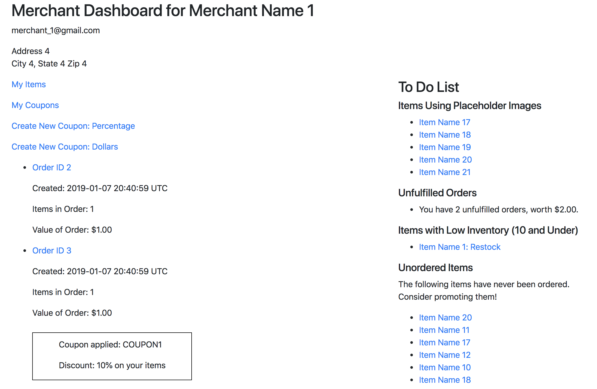
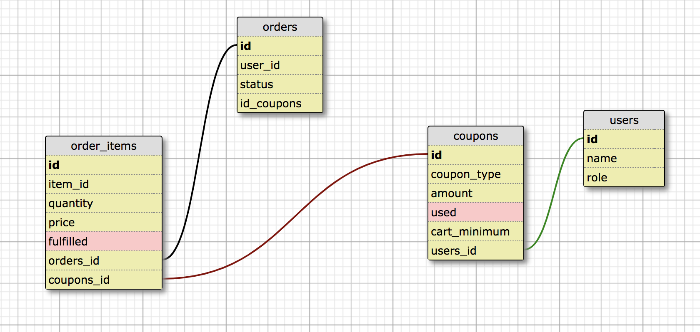

# Little Shop Extensions: Coupon Codes and Merchant To Do List

## Introduction
This is the final project for the Turing School Backend Engineering program, Module 2. [Project specifications are here.](https://github.com/turingschool-projects/little_shop_v2/blob/master/extensions.md) The project builds on an existing code base, and adds two extensions from the list. I was assigned the Coupon Codes and Merchant To Do List extensions. 

### Coupon Codes
This project implements coupon codes for merchants. A merchant can create new coupons, which have full CRUD functionality, managed by the merchants. The coupons can be either percentage-based, e.g. "10% off entire order", dollars-based, e.g. "$10 off the order", or dollars-based with a cart minimum, e.g. "$10 off orders of $20 or more". 

The coupons only apply to items in the cart and order that belong to the merchant. The coupon is reflected in the cart, as well as in the orders pages both for the customer and the merchant. 

### Merchant To Do List
This portion of the project implements a To Do list for merchants on their Dashboard. The list contains four items:
  - Items Using Placeholder Images: this shows relevant items as links to their respective edit pages.
  - Unfulfilled Orders: This gives a count of the unfulfilled orders and the revenue impact.
  - Items with Low Inventory: This shows the merchant's items which have inventory of 10 or less. Each item is a link to that item's edit page so the merchant can restock the item.
  - Unordered Items: This gives a list of all the merchant's items that have never been ordered.

## Site Hosting
The site is hosted on [Heroku](https://still-wave-97573.herokuapp.com/)

## The Database
In order to implement coupons, a coupons table was added to the database. The coupons table has a foreign key to the users table so as to link it to the merchant who created it. Also, order_items has a foreign key for the coupons table, since an order_item may have a coupon applied. The schema here shows the coupons table and its related tables.

## Installation
The project can be forked and/or cloned from: https://github.com/asmolentzov/little_shop_base_small
After cloning, run `bundle update` and then set up the database using `rake db:{drop,create,migrate,seed}`. 

### Testing
Once installed on your local machine, tests can be run using `rspec`. Tests are implemented using RSpec and Capybara. 

## Built With
  - Ruby version 2.4
  - Rails version 5.1
  - RSpec version 3.8
  - A variety of gems, notably: 
    - bcrypt for secure password handling
    - FactoryBot for ease of creating test data

## Authors
The extensions were completed by [Anna Smolentzov](https://github.com/asmolentzov), based on the code base by Turing School Instructor [Ian Douglas](https://github.com/iandouglas).

